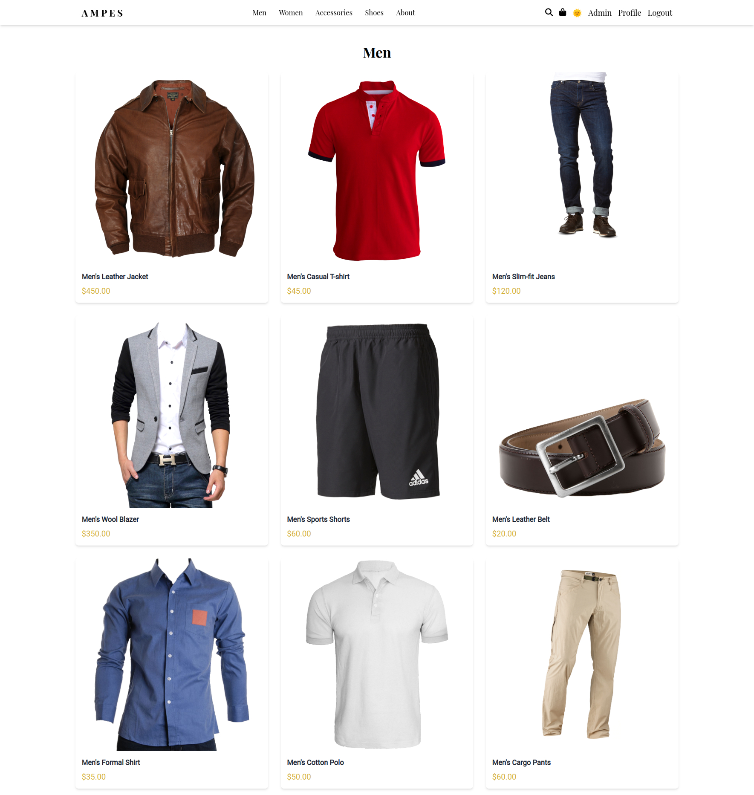
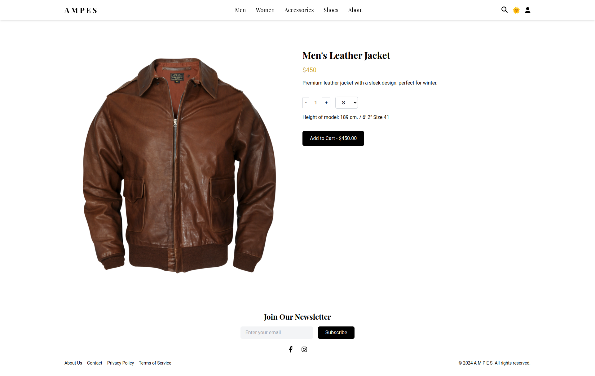
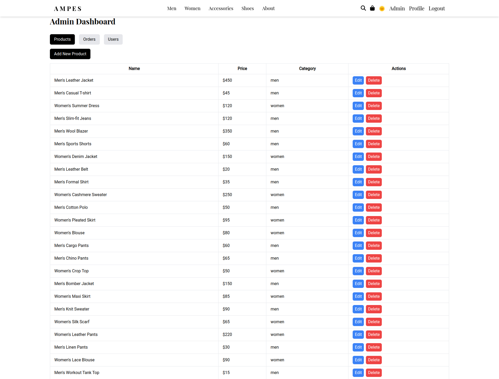

# AMPES

AMPES is a modern e-commerce web application offering a curated selection of men's and women's fashion, accessories, and shoes. The platform provides a seamless shopping experience with features like user authentication, product browsing, cart management, checkout process, and an admin dashboard for managing products, orders, and users.

## Features

- **User Authentication**: Sign up, log in, and profile management.
- **Product Browsing**: View products by category, search functionality, and detailed product pages.
- **Shopping Cart**: Add products to cart, adjust quantities, and remove items.
- **Checkout Process**: Address input, shipping options, payment integration with Stripe, and order review.
- **Order Management**: Users can view order history and request cancellations.
- **Admin Dashboard**:

  - Manage Products: Create, update, and delete products.
  - Manage Orders: View all orders, update order statuses, and export orders data.
  - Manage Users: View all users and update user roles.

- **Responsive Design**: Mobile-first design ensuring a seamless experience across devices.
- **Dark Mode Support**: Users can toggle between light and dark themes.

## Technologies Used

### Frontend

- **React**
- **React Router DOM**
- **Axios**
- **Tailwind CSS**
- **Stripe JS**
- **React Icons**
- **React Fast Marquee**

### Backend

- **Node.js**
- **Express.js**
- **MongoDB with Mongoose**
- **JWT Authentication**
- **Stripe Payment Gateway**
- **Cloudinary for Image Uploads**
- **Nodemailer for Email Notifications**

### Other Tools and Libraries

- **Axios** for HTTP requests
- **Multer** for handling file uploads
- **CSRF Protection** with csurf
- **Cookie Parser**
- **bcrypt** for password hashing
- **dotenv** for environment variables

## Screenshots

## Roadmap

- Implement advanced search and filtering options.
- Add user reviews and ratings for products.
- Integrate social media sharing features.
- Enhance admin dashboard with analytics and reporting.
- Implement wishlist functionality for users.

## Contributing

Contributions are welcome! Please open an issue or submit a pull request for any improvements or additions.

## License

[MIT License](LICENSE)

## Acknowledgments

- [Unsplash](https://unsplash.com/) for sample images.
- [Tailwind CSS](https://tailwindcss.com/) for the utility-first CSS framework.
- [Stripe](https://stripe.com/) for payment processing.

**Note:** This project is under development.
